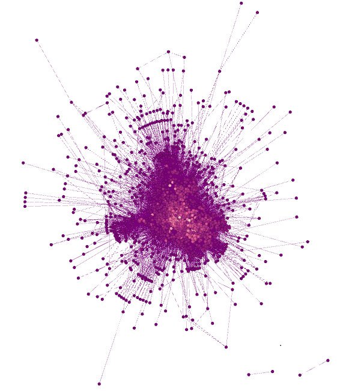
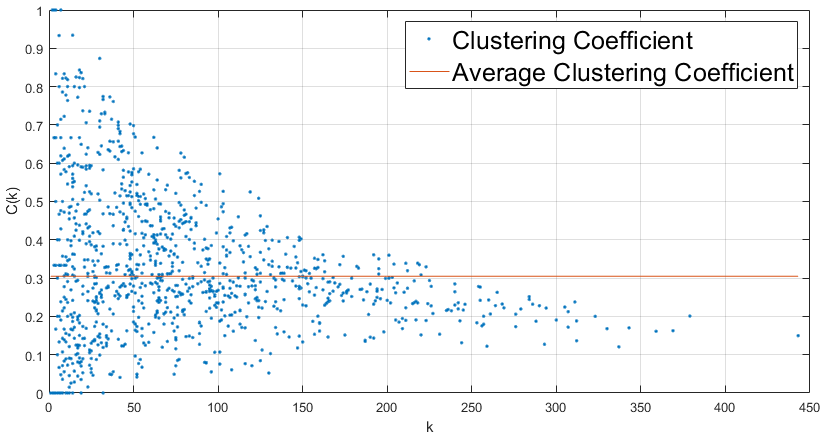
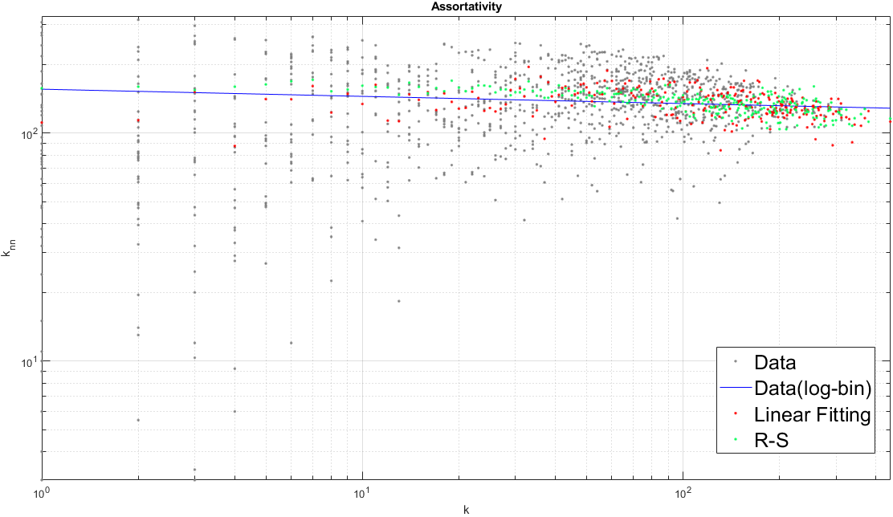
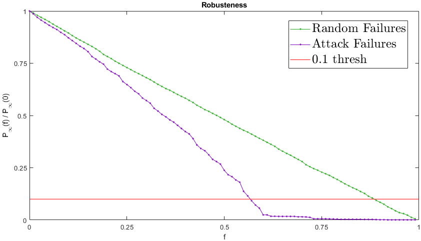
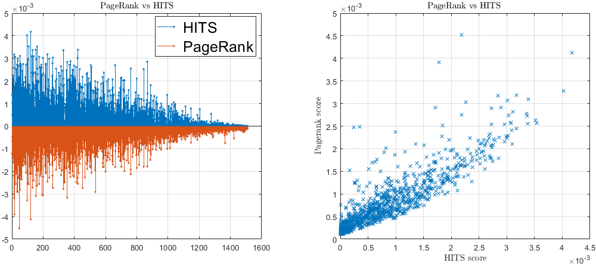
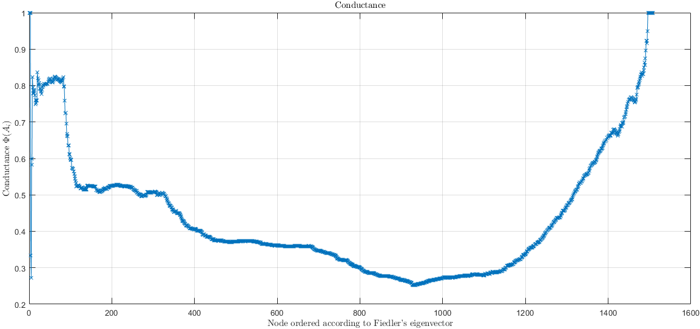
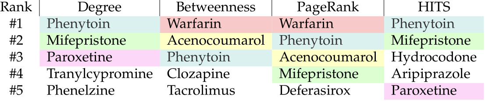
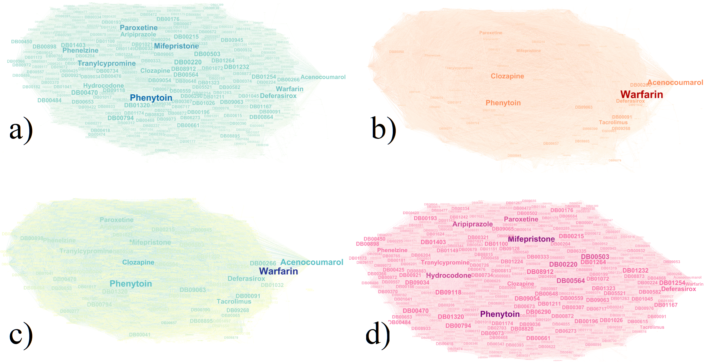
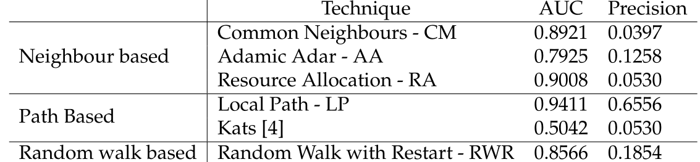

# Drug-drug-interactions-network-analysis
A network science project about a drugs interaction network.

To study the network I extract the following analytics, dividing the work in two parts:
* Part I:
  - average degree, higher moments; 
  - average distance, diameter; 
  - CCDF and ML fitting; 
  - clustering coefficient and its distribution;
  - assortativity;
  - robustness to random failures and attacks;
* Part II:
  - PageRank;
  - HITS;
  - ranking comparison: degree, betweenness, PageRank and HITS;
  - communities detection;
  - link-prediction.

>The project has been developed and tested with the following tools:
>- Python: version 3.7.5, using Pandas external library; IDE: Spyder 4.0.1.
>- MATLAB: version R2019b, service update 5.
>- Gephi: version 0.9.2.

> 
>*The network, represented with Gephi.*

> 
>*The clustering coefficients in blue, ⟨C⟩ in red.*

> 
>*Assortativity of the network.*

> 
>*Random and adversary attack on the network.*

> 
>*PageRank and HITS comparison plot.*

> 
>*Conductance of the network.*

>  
>*Comparison rank table based on nodes degree, betweenness, PageRank and HITS
>score. I highlight with the same colours the same drugs among different indexes.*
>Conductance of the network.*

> 
>*Visual representation of the a) degree and b) betweenness ranking score c) PageRank and d) HITS ranking score (Gephi).*

> 
>*AUC and Precision (with L = 151) for CM, AA, RA, LP, Kats and PWR similarity.*

 For the papers, the license used is: <a rel="license" href="http://creativecommons.org/licenses/by-nc-sa/4.0/">Creative Commons Attribution-NonCommercial-ShareAlike 4.0 International License</a>.
